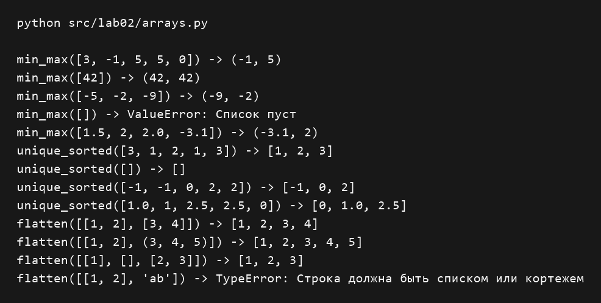
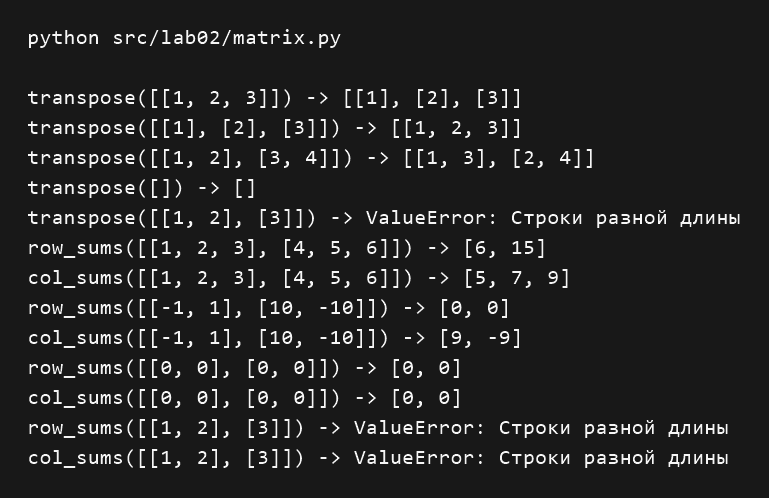
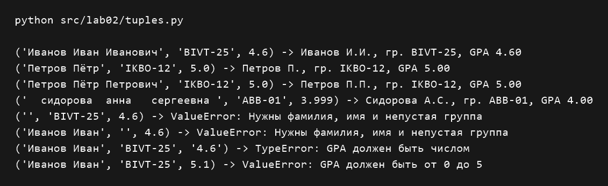

# Лабораторная работа 2

## Задание 1 — списки

Находим минимум и максимум, последовательно сравнивая числа с текущими значениями, а затем собираем уникальные элементы и сортируем их пузырьком. Для объединения вложенных списков и кортежей добавляем их элементы в общий список, предварительно проверяя тип каждой строки.

```python
def min_max(nums: list[float | int]):
    if not nums:  # Проверяем пустой список
        raise ValueError("Список пуст")

    mn = nums[0]  # Начинаем с первого числа
    mx = nums[0]
    for n in nums:  # Ищем минимум и максимум
        if n < mn:
            mn = n
        if n > mx:
            mx = n
    return mn, mx


def unique_sorted(nums: list[float | int]):
    res = []
    for n in nums:
        if n not in res:  # Пропускаем повторы
            res.append(n)

    for i in range(len(res) - 1):  # Сортировка пузырьком
        for j in range(len(res) - 1 - i):
            if res[j] > res[j + 1]:  # Сравниваем соседние числа
                res[j], res[j + 1] = res[j + 1], res[j]
    return res


def flatten(mat: list[list | tuple]):
    res = []
    for row in mat:
        if not isinstance(row, (list, tuple)):  # Проверяем тип строки
            raise TypeError("Строка должна быть списком или кортежем")
        res.extend(row)  # Добавляем элементы строки
    return res


for nums in ([3, -1, 5, 5, 0], [42], [-5, -2, -9], [], [1.5, 2, 2.0, -3.1]):
    try:
        print(f"min_max({nums}) -> {min_max(nums)}")
    except ValueError as err:
        print(f"min_max({nums}) -> ValueError: {err}")

for nums in ([3, 1, 2, 1, 3], [], [-1, -1, 0, 2, 2], [1.0, 1, 2.5, 2.5, 0]):
    print(f"unique_sorted({nums}) -> {unique_sorted(nums)}")

for mat in ([[1, 2], [3, 4]], [[1, 2], (3, 4, 5)], [[1], [], [2, 3]], [[1, 2], "ab"]):
    try:
        print(f"flatten({mat}) -> {flatten(mat)}")
    except TypeError as err:
        print(f"flatten({mat}) -> TypeError: {err}")
```



## Задание B — матрицы

Транспонируем матрицу: собираем элементы каждого столбца в отдельную строку новой матрицы. Суммы строк считаем напрямую, а суммы столбцов — после транспонирования; перед обработкой проверяем, что все строки имеют одинаковую длину.

```python
def transpose(mat: list[list[float | int]]):
    if not mat:  # Проверяем пустую матрицу
        return []
    for row in mat:
        if len(row) != len(mat[0]):  # Проверяем длину строк
            raise ValueError("Строки разной длины")

    res = []
    for j in range(len(mat[0])):  # Столбцы становятся строками
        row = []
        for i in range(len(mat)):
            row.append(mat[i][j])  # Берём элемент столбца
        res.append(row)
    return res


def row_sums(mat: list[list[float | int]]):
    if not mat:  # Проверяем пустую матрицу
        return []
    res = []
    for row in mat:
        if len(row) != len(mat[0]):  # Проверяем длину строк
            raise ValueError("Строки разной длины")
        res.append(sum(row))  # Сумма строки
    return res


def col_sums(mat: list[list[float | int]]):
    res = []
    for col in transpose(mat):  # Получаем столбцы как строки
        res.append(sum(col))  # Сумма столбца
    return res


for mat in ([[1, 2, 3]], [[1], [2], [3]], [[1, 2], [3, 4]], [], [[1, 2], [3]]):
    try:
        print(f"transpose({mat}) -> {transpose(mat)}")
    except ValueError as err:
        print(f"transpose({mat}) -> ValueError: {err}")

for mat in ([[1, 2, 3], [4, 5, 6]], [[-1, 1], [10, -10]], [[0, 0], [0, 0]], [[1, 2], [3]]):
    try:
        print(f"row_sums({mat}) -> {row_sums(mat)}")
    except ValueError as err:
        print(f"row_sums({mat}) -> ValueError: {err}")
    try:
        print(f"col_sums({mat}) -> {col_sums(mat)}")
    except ValueError as err:
        print(f"col_sums({mat}) -> ValueError: {err}")
```



## Задание C — кортежи

Преобразуем кортеж с ФИО, группой и средним баллом в строку, сначала проверяя типы полей и допустимые значения. Убираем лишние пробелы, записываем фамилию с заглавной буквы, заменяем имя и отчество инициалами, а средний балл выводим с двумя знаками после запятой.

```python
def format_record(rec: tuple[str, str, float]):
    if not isinstance(rec, tuple):  # Проверяем тип записи
        raise TypeError("Запись должна быть кортежем")
    if len(rec) != 3:  # В записи три поля
        raise ValueError("В записи должно быть три поля")
    fio, grp, gpa = rec  # Разбираем кортеж
    if not isinstance(fio, str) or not isinstance(grp, str):
        raise TypeError("ФИО и группа должны быть строками")
    if type(gpa) not in (int, float):
        raise TypeError("GPA должен быть числом")

    p = fio.split()  # Разделяем ФИО без лишних пробелов
    grp = " ".join(grp.split())  # Убираем лишние пробелы
    if len(p) not in (2, 3) or not grp:  # Проверяем ФИО и группу
        raise ValueError("Нужны фамилия, имя и непустая группа")
    if not 0 <= gpa <= 5:  # Проверяем диапазон среднего балла
        raise ValueError("GPA должен быть от 0 до 5")

    ini = ""
    for name in p[1:]:  # Собираем инициалы
        ini += name[0].upper() + "."  # Заглавная буква и точка
    return f"{p[0].capitalize()} {ini}, гр. {grp}, GPA {gpa:.2f}"


for rec in (
    ("Иванов Иван Иванович", "BIVT-25", 4.6),
    ("Петров Пётр", "IKBO-12", 5.0),
    ("Петров Пётр Петрович", "IKBO-12", 5.0),
    ("  сидорова  анна   сергеевна ", "ABB-01", 3.999),
    ("", "BIVT-25", 4.6),
    ("Иванов Иван", "", 4.6),
    ("Иванов Иван", "BIVT-25", "4.6"),
    ("Иванов Иван", "BIVT-25", 5.1),
):
    try:
        print(f"{rec} -> {format_record(rec)}")
    except (ValueError, TypeError) as err:
        print(f"{rec} -> {type(err).__name__}: {err}")
```


